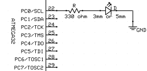

# AVR cheatsheet
## Installation
### 1. avr-gcc toolchain
```bash
sudo apt-get install gcc-avr binutils-avr avr-libc gdb-avr
```
### 2. avrdude
AVR-GCC is a toolchain that will help you with the software development process, but doesn’t do anything about burning the final executable (the hex file) to the microcontroller. For that we need to install AVR Downloader UploaDEr (avrdude).
```bash
sudo apt-get install avrdude
```
---

### Example Project: Blink


### Source file: led.c

```c
#ifndef F_CPU
#define F_CPU 16000000UL // or whatever may be your frequency
#endif

#include <avr/io.h>
#include <util/delay.h>                // for _delay_ms()
 
int main(void)
{
    DDRC = 0x01;                       // initialize port C
    while(1)
    {
        // LED on
        PORTC = 0b00000001;            // PC0 = High = Vcc
        _delay_ms(500);                // wait 500 milliseconds
 
        //LED off
        PORTC = 0b00000000;            // PC0 = Low = 0v
        _delay_ms(500);                // wait 500 milliseconds
    }
}
```
---

### Compiling and linking
This first thing that needs to be done is compile the source. When compiling, the compiler needs to know the processor type so the -mmcu option is specified. The -Os option will tell the compiler to optimize the code for efficient space usage (at the possible expense of code execution speed). The -g is used to embed debug info. The debug info is useful for disassemblies and doesn't end up in the .hex files, so I usually specify it. Finally, the -c tells the compiler to compile and stop – don't link. This sample is small enough that we could compile and link in one step. However, real-world projects will have several modules and will typically need to break up the building of the project into several compiles and one link.

```bash
avr-gcc -g -Os -D F_CPU=16000000 -mmcu=atmega328p -c led.c
```
The compilation will create a led.o file. Next we link it into a binary called led.elf.
```bash
avr-gcc -g -mmcu=atmega328p -o led.elf led.o
```
We have a binary of the application, but how do we get it into the processor? Most (if not all) programmers will not accept a GNU executable as an input file, so we need to do a little more processing. The next step is to extract portions of the binary and save the information into .hex files. The GNU utility that does this is called `avr-objcopy`.
```bash
avr-objcopy -O ihex -R .eeprom led.elf led.hex
```
### Flashing/Burning
To Upload the processed .hex to the avr microcontroller 
```bash
avrdude -c usbasp -p m328p -U flash:w:led.hex
```
### Summary

</img>

---

### Makefile
Makefiles are just text files containing rules on what to do if a file was updated.

```makefile
# package name
PKG=led
BIN=${PKG}
OBJS=${PKG}.o
MCU=atmega328p

CC=avr-gcc
OBJCOPY=avr-objcopy
CFLAGS=-Os -D F_CPU=16000000UL -mmcu=${MCU} -Wall
PORT=/dev/ttyUSB0

#compiling
all:${BIN}.hex

${BIN}.hex: ${BIN}.elf
	${OBJCOPY} -O ihex -R .eeprom $< $@

${BIN}.elf: ${OBJS}
	${CC} -mmcu=${MCU} -o $@ $^

install: ${BIN}.hex
	avrdude -c usbasp -p ${MCU} -P ${PORT} -b 115200 -U flash:w:$<

clean:
	rm -f ${BIN}.elf ${BIN}.hex ${OBJS}
```

`$@` is the name of the target being generated, and `$<` the first prerequisite (usually a source file). 
example
```makefile
all: library.cpp main.cpp
```
In this case:
* `$@` evaluates to `all`
* `$<` evaluates to `library.cpp`
* `$^` evaluates to `library.cpp main.cpp`

[Clarification](Clarification)